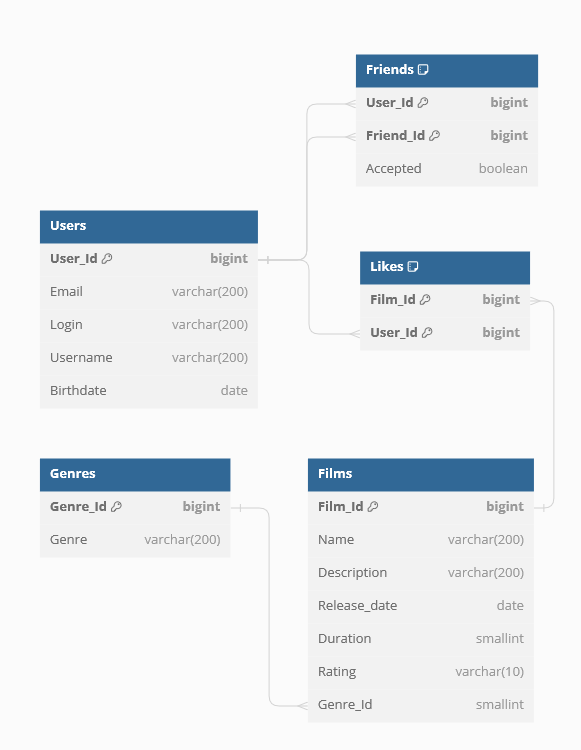

# java-filmorate
## ER-diagram:



##DDL (using h2 DB)
Users
```
CREATE TABLE IF NOT EXISTS Users (
User_Id IDENTITY NOT NULL PRIMARY KEY,
Email varchar(200) NOT NULL,
Login varchar(200),
Username varchar(200),
Birthdate date
);
```
Films
```
CREATE TABLE IF NOT EXISTS Films (
Film_Id IDENTITY NOT NULL PRIMARY KEY,
Name varchar(200) not null,
Description varchar(200),
Release_date date,
Duration smallint,
Rating varchar(10),
Genre_Id smallint
);
```
Friends
```
CREATE TABLE IF NOT EXISTS Friends (
User_Id bigint,
Friend_Id bigint,
Accepted boolean DEFAULT false,
CONSTRAINT PK_user_friend PRIMARY KEY (User_Id, Friend_Id)
);
```
Likes
```
CREATE TABLE IF NOT EXISTS Likes (
Film_Id bigint,
User_Id bigint,
CONSTRAINT PK_film_user PRIMARY KEY (Film_Id, User_Id)
);
```
Genres
```
CREATE TABLE IF NOT EXISTS Genres (
Genre_Id IDENTITY NOT NULL PRIMARY KEY,
Genre varchar(200)
);
```
Foreign Keys for tables
```
ALTER TABLE Friends ADD CONSTRAINT IF NOT EXISTS FK_User_Friend FOREIGN KEY (User_Id) REFERENCES Users(User_Id); 
ALTER TABLE Friends ADD CONSTRAINT IF NOT EXISTS  FK_Friend_User FOREIGN KEY (Friend_Id) REFERENCES Users(User_Id);
ALTER TABLE Likes ADD CONSTRAINT IF NOT EXISTS  FK_User_Like FOREIGN KEY (User_Id) REFERENCES Users(User_Id);
ALTER TABLE Likes ADD CONSTRAINT IF NOT EXISTS  FK_Film_Like FOREIGN KEY (Film_Id) REFERENCES Films(Film_Id);
ALTER TABLE Films ADD CONSTRAINT IF NOT EXISTS  FK_Film_Genre FOREIGN KEY (GENRE_ID) REFERENCES Genres(GENRE_ID);
```
##SQL Queries
###Users
Return all users
>SELECT * FROM Users;
> 
Create user
>INSERT INTO Users (Email, Login, Username, Birthdate) VALUES (?, ?, ?, ?);
> 
Update user
>UPDATE Users SET Email = ?, Login = ?, Username = ?, Birthdate =? WHERE User_Id = ?;
>
Return user by Id
>SELECT * FROM Users WHERE User_Id = ?;
> 
###Films
Return all films
>SELECT * FROM Films;
>
Create film
>INSERT INTO Films (Name, Description, Release_date, Duration, Rating, Genre_Id) VALUES (?, ?, ?, ?, ?, ?);
>
Update film
>UPDATE Films SET Name = ?, Description = ?, Release_date = ?, Duration =? WHERE Film_Id = ?;
>
Return film by Id
>SELECT * FROM Films WHERE Film_Id = ?;
>
###Friends
Add friend
>INSERT INTO Friends (User_Id, Friend_Id) VALUES (?, ?);
> 
Set accepted = true
>UPDATE Friends SET Accepted = TRUE WHERE User_Id = ? AND Friend_Id = ?;
> 
Get friends
>SELECT * FROM Users WHERE User_Id IN (SELECT Friend_Id FROM Friends WHERE User_Id = 1);
>
###Genres
Get genre by ID
>SELECT Genre FROM Genres WHERE Genre_Id = ?;
> 
###Likes
Set like
>INSERT INTO Likes (User_Id, Film_Id) VALUES (?, ?);
> 